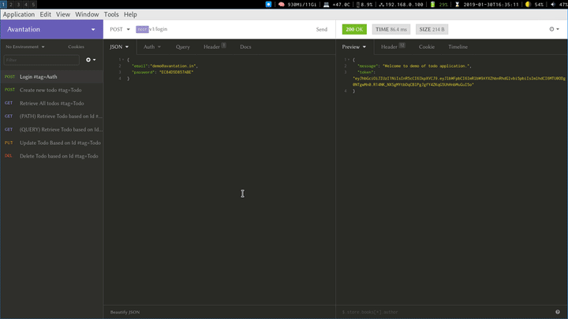

# avantation

avantation is tool the for generate OpenAPI3.0 from HTTP Archive format(HAR).

avantation is written and maintained by Anbarasan K (anbu@nullobject.io).

[](https://npmjs.org/package/avantation) [](https://npmjs.org/package/avantation) [](https://github.com/anbuksv/avantation/blob/master/package.json)

- Project home page: http://avantation.in/
- Code home page: https://github.com/anbuksv/avnatation
- Issue tracker: https://github.com/anbuksv/avantation/issues

# Install

Direct downloads are available through the [releases page](https://github.com/anbuksv/avantation/releases/latest).

If you have Node installed on your computer just run npm install

```
npm install -g avantation
```

# Features

- HTTP sample code generation
- Dynamic route path conversion
- Schema generation
- Supports json/yaml output formats
- JWT authentication header mapping
- Static-UI generation

# Usage

```sh-session
Build OpenAPI specification from HAR.

USAGE
  $ avantation HAR

ARGUMENTS
  HAR  http archive(har) path

OPTIONS
  -b, --base-path=base-path                Separate the common path as base path
                                           from HTTP requests.
                                           Example:['api/v1']

  -h, --host=host                          Filter the http request from HAR and
                                           use it as server url in output.

  -j, --json                               Write output result in JSON format.

  -o, --out=out                            [default: ./openapi.yaml] Write
                                           output result at this DEST location.

  -r, --path-param-regex=path-param-regex  [default: [0-9]|[-$@!~%^*()_+]]
                                           Convert Regex matching params into
                                           dynamic path

  -s, --security-headers=security-headers  [default: {}] Map matching HTTP
                                           headers into security headers on
                                           request.

  -t, --template=template                  To override the default template pass
                                           the your template file location.

  --build-static-ui                        Build the static user interface from
                                           generated OpenAPI3.0 specification.

  --disable-tag                            Diable end points grouping based on
                                           route path in HAR

  --http-snippet                           Generate HTTP smaple code snippet for
                                           request and appedn it as
                                           'x-code-sample' to OpenAPI path
                                           object.

  --static-ui-logo=static-ui-logo          Static-UI logo file location

```

# Demo

## Existing Projects


## New Projects



## Demo Results

- **Static-UI** - https://demo.avantation.in/ui/
- **Swagger-UI** - https://demo.avantation.in/ui/swagger/
- **Redoc-UI** - https://demo.avantation.in/ui/swagger/redoc.html
